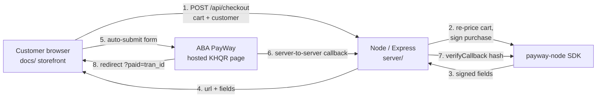

# 🧋 KHQR Checkout — Sang Café

> A full-stack Cambodian storefront demo with **ABA PayWay KHQR** checkout.
> Browse a menu → build a cart → pay by scanning **one QR with any Cambodian bank**
> (ABA, ACLEDA, Wing…). Backend powered by the [`payway-node`](https://github.com/Rimsovannara/payway-node) SDK.

<p>
  
  
  
  
</p>

### ▶️ [**Live demo →** rimsovannara.github.io/khqr-checkout](https://rimsovannara.github.io/khqr-checkout/)

The live demo runs in **demo mode** (no server, no real charge) so you can click the
whole flow. Point it at a real ABA PayWay **sandbox** and the identical frontend does a
genuine KHQR checkout — see [Going live](#-going-live-with-payway-sandbox).

---

## ✨ Features

- 🛒 **Real storefront flow** — product grid, cart drawer, quantity controls, cart saved to `localStorage`.
- 💳 **KHQR / ABA Pay checkout** — the customer scans one QR with any Cambodian banking app.
- 🔐 **Secure by design** — the **cart total is recalculated on the server** (never trust the client), the **API key stays server-side**, and PayWay callbacks are **signature-verified** before an order is marked paid.
- 🌗 **Responsive + dark mode** — works on a phone, tablet, or desktop; adapts to the system theme.
- 🇰🇭 **Bilingual** — English + Khmer (ខ្មែរ) product names, USD & KHR ready.
- ♻️ **One frontend, two modes** — auto-detects whether a backend is present; falls back to a labelled demo so the static build is always clickable.

---

## 🏗️ Architecture



**Why this matters:** the browser never sees the API key and never sets its own price.
The server signs every purchase and verifies every callback — the correct way to wire a
payment gateway.

---

## 🚀 Run it locally (2 minutes)

```bash
git clone https://github.com/Rimsovannara/khqr-checkout.git
cd khqr-checkout
npm install
npm start
# open http://localhost:3000  → runs in DEMO mode
```

No credentials needed for demo mode. The server serves the same `docs/` frontend that
GitHub Pages hosts, plus the `/api/*` endpoints.

---

## 🔑 Going live with PayWay (sandbox)

1. Register a free sandbox merchant at <https://sandbox.payway.com.kh/register-sandbox/>.
2. Copy `.env.example` to `.env` and fill in your credentials:
   ```env
   PAYWAY_MERCHANT_ID=ec12345
   PAYWAY_API_KEY=your-secret-key
   PAYWAY_ENVIRONMENT=sandbox
   ```
3. `npm start` — the badge flips to **LIVE · SANDBOX** and checkout now redirects to the
   real ABA PayWay KHQR page. Pay with ABA's sandbox test wallet/cards.

---

## 🗂️ Project structure

```
khqr-checkout/
├── docs/                 # static storefront (served by GitHub Pages AND the Node server)
│   ├── index.html        #   markup + KHQR checkout modal
│   ├── styles.css        #   coffee/KHQR theme, responsive, dark mode
│   └── app.js            #   cart, mode detection, QR + checkout flow
├── server/
│   ├── index.js          # Express app, static + API
│   ├── payway.js         # PayWayClient from env; detects demo vs live
│   ├── products.js       # product catalog (DB stand-in)
│   └── routes/
│       ├── checkout.js   # POST /api/checkout, GET /api/orders/:id
│       └── callback.js   # POST /api/payway/callback (signature-verified)
├── .env.example
└── package.json
```

---

## 🧰 Tech

**Frontend:** vanilla JS (no framework), CSS Grid/Flexbox, `qrcodejs`.
**Backend:** Node.js 18+, Express.
**Payments:** [`payway-node`](https://github.com/Rimsovannara/payway-node) — my own dependency-free ABA PayWay SDK.

> A **Laravel / PHP** implementation of the same store (using
> [`payway-laravel`](https://github.com/Rimsovannara/payway-laravel)) lives on the
> [`laravel`](https://github.com/Rimsovannara/khqr-checkout/tree/laravel) branch.

---

## 📌 Notes

- This is a **demo/portfolio project**, not affiliated with ABA Bank. A real merchant
  account is required for production payments.
- Orders are stored in memory for simplicity — swap in a database for real use.

---

**Built by [Rim Sovannara](https://github.com/Rimsovannara)** — full-stack developer, Cambodia 🇰🇭
Portfolio: [rimsovannara.github.io](https://rimsovannara.github.io/)
